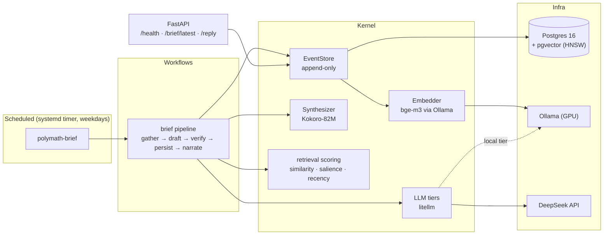

# Polymath

A self-hosted personal AI companion, running on a desktop PC that had been switched off for two years.

Every weekday morning it gathers the weather and the day's headlines, recalls what I have said to it before, writes a short spoken brief, **checks that brief for claims its data does not support**, and reads it aloud. Everything it hears is stored as an append-only event with an embedding, so it remembers.

The companion's persona is called **Hera**. Polymath is the system she runs on.

> [!NOTE]
> Early and in daily use. The morning brief and long-term memory work end to end and run on a schedule. Retrieval over research papers (RAG) is the next milestone; see [Roadmap](#roadmap).

---

## Why this exists

I wanted a companion that lives on hardware I own rather than in a browser tab, and that I could take apart and understand. So the constraint was the PC already under my desk:

| Component | Spec |
|---|---|
| CPU | Intel i5-10400F (6 cores) |
| RAM | 16 GB |
| GPU | NVIDIA RTX 2060, 6 GB VRAM |
| Storage | SATA SSD (no NVMe on the H410M board) |
| OS | Ubuntu Server, headless |

Before writing any code I measured what that hardware could actually do (see [Model benchmarks](#model-benchmarks)). Those numbers drove the architecture: what runs on the GPU, what runs on the CPU, and what goes to an API.

---

## Architecture



The code is split by how often each part should change:

```
src/polymath/
├── kernel/          infrastructure behind Protocols: store, embedding, llm, speech, retrieval
├── workflows/       pipelines that compose the kernel: the morning brief and its sources
├── prompts/         prompt assets, versioned
├── observability/   JSON logs in the OpenTelemetry log vocabulary
├── api.py           HTTP surface
└── cli.py           scheduled entry point
```

Workflows depend on `kernel` only through `typing.Protocol` interfaces (`LLM`, `Embedder`, `Synthesizer`, `BriefSource`). That is what lets the tests swap in a deterministic fake embedder, and what will let the paper RAG reuse the same store and models without touching the brief.

---

## The morning brief

The brief is a **deterministic pipeline, not an agent**. The steps are known in advance, so each one is a plain function and the orchestrator only sequences them.

1. **Gather.** Weather (Open-Meteo) and RSS headlines are fetched concurrently. A failing source is logged and skipped; the brief only fails if *every* source does. A source with nothing to contribute raises instead of returning an empty fragment, so the model is never handed an empty block it might fill in.
2. **Recall.** Today's items are embedded and matched against things I have said before. Recall is only included above a relevance threshold: a forced callback every morning reads as mechanical.
3. **Draft.** Data goes to the model inside `<data>` tags so it can tell instructions from input.
4. **Verify.** Two layers, cheapest first:
   - a **deterministic guard** rejects phrases that claim knowledge about me ("you mentioned", "your kind of thing") whenever nothing was actually recalled;
   - an **LLM verifier** scores every claim against the source data.

   A draft ships only if it passes *both*: a score at or above the floor *and* no named issue. A rejected draft is regenerated once, with the reason for the rejection.
5. **Persist and narrate.** The brief is stored as an event, with the prompt version, token count and verifier verdict in its metadata, then rendered to speech. If speech fails, the text brief still exists.

### The guard, in production

From the journal on 1 October 2026:

```json
{"body": "draft rejected; regenerating once", "quality_score": 0.0,
 "quality_issue": "unsupported claim about Hugo: kind of thing you"}
{"body": "brief composed", "quality_score": 10.0, "tokens": 93}
```

The first draft invented a preference with no data behind it. The deterministic guard caught it before the model-based verifier ran, and the regenerated draft passed.

---

## Memory

Everything Polymath stores is an **event**: an immutable fact with a source, a modality, a salience between 0 and 1, and a 1024-dimensional `bge-m3` embedding. Events are never updated; corrections are new events. The table is indexed with HNSW for cosine search, and every row records which embedding model and version produced its vector, so the store can be re-embedded later without guessing.

Ranking combines three signals:

```
score = 0.60 · similarity + 0.25 · salience + 0.15 · recency
recency = exp(−age_days / τ_source)
```

The decay constant depends on the source, because different kinds of memory go stale at different rates:

| Source | τ (days) | Why |
|---|---|---|
| news | 3 | worthless within a week |
| chat | 45 | what I said should outlive the week it was said |
| quest | 90 | |
| drawing | 180 | a hard-won explanation should persist |

This follows the retrieval scheme used for memory in *Generative Agents* (Park et al., 2023), with per-source decay added.

---

## Model benchmarks

Measured on my own hardware with Ollama, generation throughput (`eval rate`):

| Model | Machine | Generation | Notes |
|---|---|---|---|
| qwen3:4b-instruct | PC, RTX 2060 6 GB | ~97 tok/s | ~3.1 GB VRAM; default local model |
| qwen3:4b-instruct | Laptop, RTX 4060 Laptop 8 GB | ~58 tok/s | slower despite the newer GPU |
| qwen3:30b-a3b (MoE) | Laptop | ~27 tok/s | clearly better output; prompt eval drops to ~3 tok/s as experts spill to system RAM |

**Decision:** the 4B model is fast enough but too weak for writing that has to sound like a person, and the 30B model's prompt processing is too slow for a morning routine. So generation goes to the **DeepSeek API through litellm**, while embeddings and the database stay on the PC and the GPU stays free for them. The model behind each tier is configuration, not code: `FAST` uses whatever `.env` points at, `REASONING` runs a local model on Ollama, and `FRONTIER` is reserved for a stronger remote model.

> [!IMPORTANT]
> Storage and embeddings are local. **Generation is not:** the brief sends the weather, headlines and any recalled snippets of what I said to the DeepSeek API. A sensitivity flag that keeps private material on the local model is on the [roadmap](#roadmap).


---

## Engineering

- **Strict typing:** `mypy --strict` across `src` and `tests`.
- **Lint and format:** ruff, enforced with a pre-commit hook that runs the versions pinned in `uv.lock`.
- **Tests:** pytest. Store tests run against a real Postgres inside a transaction that is always rolled back; model and network calls are replaced with fakes. Each test is written so that it can fail: the fake embedder gives every text its own direction, because constant vectors would make every cosine distance zero.
- **Errors:** explicit exception types per boundary (`EmbeddingError`, `LLMError`, `SpeechError`, `SourceError`); API errors follow RFC 9457 Problem Details with a correlation id.
- **Observability:** one JSON object per log line, using OpenTelemetry field names so an exporter can be added later without touching call sites.
- **Prompt traceability:** every stored brief records the prompt version that produced it.

---

## Running it

Requirements: Docker, [uv](https://docs.astral.sh/uv/), and [Ollama](https://ollama.com) with `bge-m3` pulled.

```bash
cp .env.example .env            # set DB_PASSWORD and DEEPSEEK_API_KEY
docker compose up -d            # Postgres + pgvector, bound to localhost only
uv sync
uv run pre-commit install       # hooks are not versioned; install them per clone
uv run alembic upgrade head
ollama pull bge-m3

uv run polymath-brief                         # compose today's brief now
uv run uvicorn polymath.api:app               # HTTP API on 127.0.0.1:8000
uv run pytest                                 # needs the database running
```

### Deployment

The brief runs from a systemd user timer, versioned in [`deploy/systemd/`](deploy/systemd):

```bash
systemctl --user link ~/dev/polymath/deploy/systemd/polymath-brief.{service,timer}
systemctl --user daemon-reload
systemctl --user enable --now polymath-brief.timer
sudo loginctl enable-linger "$USER"     # run without an open login session
```

The timer is scheduled in `Europe/Madrid` local time so it does not drift when the clocks change. The service loads `.env` explicitly and retries on failure, because a run caught up after boot can start before Wi-Fi is up. The API is reached remotely through Cloudflare Tunnel with Cloudflare Access in front of it.

---

## Roadmap

**Next: retrieval over research papers (MVP)**
- [ ] `document_chunk` table, separate from personal memory: different data, different reasons to change
- [ ] PDF ingestion split by section, with paper, section and page metadata; references removed
- [ ] Hybrid retrieval: BM25 + dense vectors, fused with Reciprocal Rank Fusion
- [ ] Hand-labelled question set; recall@k, MRR, latency and cost per query reported here
- [ ] `/ask` answering with `[paper, page]` citations, and "not in the sources" when there is no evidence
- [ ] Sensitivity flag: private material never reaches a remote model

**Later**
- Conversation with memory (today `/reply` stores what I say but does not answer)
- A daily *Quick Quest*: one STEM curiosity and one problem, each day linked to the last
- Calendar and Google Classroom in the brief; playback on the client device
- A UI that changes with the routine, and an animated presence for Hera
- CI on GitHub Actions
