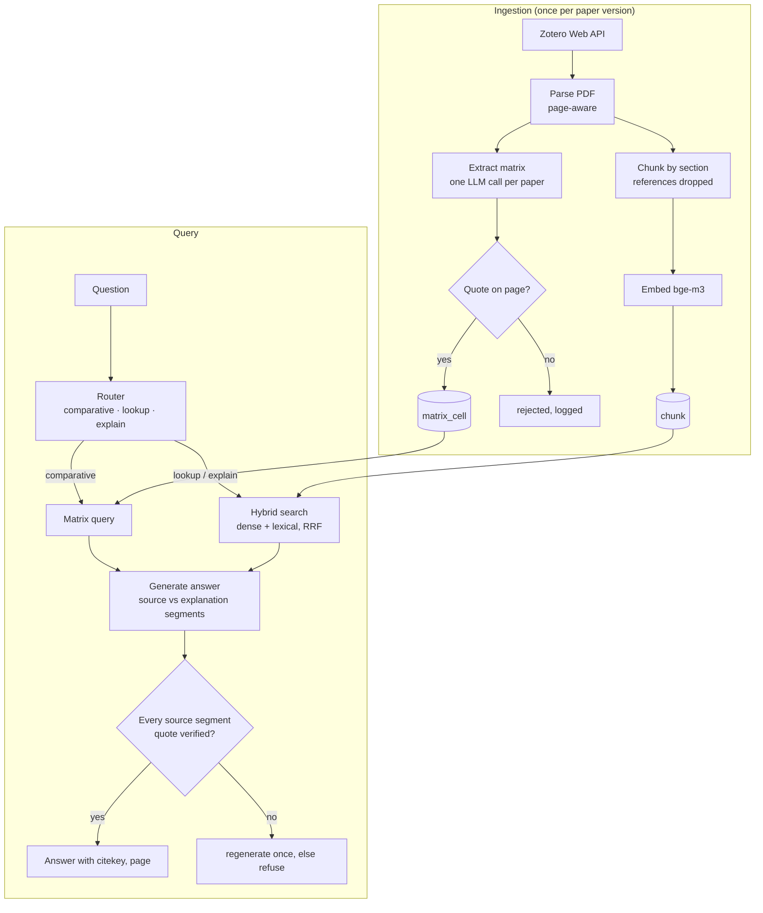

# Research assistant over dissertation papers

| | |
|---|---|
| **Status** | Draft, in review |
| **Issue** | #1 |
| **Author** | Hugo Hernández Moreno |
| **Scope** | MVP: 37 papers in three Zotero sub-collections |

## 1. Problem

The dissertation (shared autonomy and reactive stability control on a 1:10 buggy) draws on more papers than I can hold in my head. The questions I actually ask fall into three kinds, and plain top-k RAG serves only one of them well:

| Kind | Example | Why plain RAG struggles |
|---|---|---|
| **Comparative** | "Which papers control lateral stability with yaw rate, and with which vehicle model?" | Needs *every* relevant paper. Top-k returns the k most similar chunks; if twelve papers qualify, it silently drops seven. |
| **Lookup** | "What sampling frequency does paper X use in its controller?" | Works, if retrieval can be filtered to one paper. |
| **Explanatory** | "Based on paper X, explain Y." | Repeating the paper's text does not help when the text is what I did not understand. The answer must explain in other words *and* show what it rests on. |

## 2. Goals and non-goals

**Goals**
- Answer the three kinds of question over the 37 papers in scope.
- Never present an unsupported claim as coming from a paper: every claim about a paper carries a page and a verbatim quote that has been checked.
- Measure retrieval and extraction quality on questions I write myself, and report the numbers.

**Non-goals (MVP)**
- The other eight sub-collections (~170 papers).
- Citation graph, concept graph (GraphRAG / HippoRAG).
- Conversation memory across questions; a UI.
- Fine-tuning or training any model.

## 3. Corpus

Zotero sub-collections under *IS40 — Stability Control*:

| Sub-collection | Papers |
|---|---|
| stability control | 15 |
| state estimation | 10 |
| friction estimation | 12 |

PDFs are available through Zotero file sync, so the server ingests from the Zotero Web API and does not depend on the laptop. Papers are published work: their sensitivity is `PUBLIC`, so sending passages to the remote generation model is acceptable.

## 4. Overview

Four capabilities, one shared store. The *structure* of a question decides which one answers it.



## 5. Decisions

Each decision lists what was chosen, what was rejected, and why. These are the parts of the design to challenge.

### D1. A literature matrix, not only RAG

**Chosen:** at ingestion, an LLM reads each paper once and fills a schema; each non-empty cell carries a page and a verbatim quote. Comparative questions become queries over that table.

**Rejected:** answering comparative questions with top-k retrieval and a larger k.

**Why:** a larger k trades one failure for another: more noise per question and still no guarantee of completeness. Extraction moves the cost to ingestion, where it is paid once per paper (~0.5M tokens for all 37), and makes comparative answers exact and cheap at query time. It also matches how a literature review is done by hand.

### D2. Store matrix cells as rows, grouped by contribution

**Chosen:** `matrix_cell(paper_id, contribution, attribute, value, page, quote, …)`, where `contribution` groups the attributes that belong together inside one paper.

**Rejected:** one table, or one column per attribute.

**Why:** the schema differs per sub-collection (§6), and rows let a new attribute be added without a migration. The `contribution` key fixes a flaw in plain attribute/value rows: a paper that tests an LQR controller on a bicycle model and an MPC controller on a four-wheel model would otherwise store four loose facts, and the pairing of controller and model would be lost. This is how the Open Research Knowledge Graph represents papers: subject–predicate–object triples grouped into *contributions*, with a reusable template per research domain, from which comparison tables are generated. The cost is that "papers with filter = EKF *and* model = bicycle" needs a self-join on `(paper_id, contribution)`; at 37 papers that is irrelevant.

### D3. A deterministic quote check, with normalisation

**Chosen:** a cell is stored only if its quote is found on the cited page after normalising both sides (Unicode NFKC, ligatures such as `fi`, hyphenation across line breaks, whitespace).

**Rejected:** trusting the model's quote; asking a second model whether the quote is genuine.

**Why:** the same principle as the brief's regex guard: an invented citation is the defect that matters most, and it can be caught exactly and for free. Without normalisation, real quotes would fail on PDF artefacts, so the check would reject true cells and get switched off.

### D4. PyMuPDF for parsing; GROBID only if measured to be needed

**Chosen:** PyMuPDF, extracting text per page in reading order, with section headings detected by font size and numbering.

**Rejected for now:** GROBID (a Java service producing structured TEI with clean sections and references).

**Why:** GROBID is better at structure but adds a service to run and maintain. With 37 papers I can inspect the section detection by hand. If headings are wrong in more than a few papers, GROBID is the next step, and the change is isolated behind the parser interface.

**Generic rules first, publisher exceptions only where measured:** body text is the most common font (family and size, by character count); headings are short lines set in a different font from the body (larger, bold, or another family), with numbering as supporting evidence only (`2.1.`, Roman numerals in IEEE: `I. INTRODUCTION`); captions start with `Fig.`, `Figure`, `Table` or `TABLE`. One or two sample papers per publisher validate these rules and become **parser regression tests**: each sample stores its expected headings and captions, and `pytest` fails if a rule change breaks another publisher.

**Evidence (first paper, Lee & Oh 2025, MDPI *Electronics*):** sections (bold 12 pt), subsections (italic, numbered) and the 20 figure and 3 table captions (bold 9 pt) are all detectable; PDF page numbers match the printed ones; table text survives. **Display equations do not:** `∫₀ᵗ e dt` is extracted as `0 edt`. Heading rules are publisher-specific, so each publisher in the corpus needs its own check.

**Evidence (six papers, five publishers: MDPI, IEEE, Elsevier, Sage, Taylor & Francis):**

| Finding | Consequence |
|---|---|
| Body size ranges from 8.1 pt (Elsevier) to 10.5 pt (T&F); IEEE captions are not bold; Elsevier headings are the same size as the body | Rules are relative to each paper's body font, never absolute sizes |
| `Adv…` fonts encode symbols privately: `þ`→`+`, `¼`→`=`, `ð`/`Þ`→`(`/`)`, and `:` as the decimal point (`μ ¼ 0:5` is `μ = 0.5`). Seen in Elsevier **and Sage** (Liang: 121 suspect glyphs), so it belongs to the typesetter's fonts, not to one publisher | The character map is keyed by font, not by publisher (see the row on per-font encodings below), and runs before anything else, including equation-number detection, since `ð1Þ` is `(1)`. Without it, the matrix would store `0:5` with a quote that *matches the corrupted text*, so D3 would pass a wrong value |
| Sage headings are **neither numbered nor bold** (Liang: no line flagged bold; `Introduction` never appears as a candidate). `Abstract` and `References` are set at body size in `AdvPS8E82`, a different family from the body's `AdvTimes` | Neither numbering nor weight is reliable. The primary signal is a **font family different from the body's**, at body size or larger, on a short line; captions are told apart by their size and the `Figure N.` pattern |
| **Font difference finds every heading in all six papers, but with poor precision.** Equation lines (math fonts: `CMR10`, `MTSY`, `AdvP4C4E74`, italic `MinionPro-It`), running headers (`Liang et al.`, `Proc IMechE…`), page numbers, theorem statements in italics, and text inside figures (axis labels, extracted reversed: `rello`, `etar`) are also set in non-body fonts | Font difference is a recall filter, not a decision. Precision comes from extra filters: drop lines repeated across pages, lines that are mostly digits or maths symbols, lines ending in an equation number, and text inside figure regions. If the publisher embedded a PDF outline (bookmarks), it is used instead of the heuristic |
| A PDF outline (bookmarks) exists in 3 of 6 samples: MDPI (11 entries, 2 levels), Taylor & Francis (21, 2 levels), Elsevier (18, 3 levels, with clean ASCII titles such as `PIDplusFF and Hinfty` where the body text is garbled). It is **absent in both Sage papers and in the IEEE conference paper** | Outline first, font rules as fallback. The three papers with an outline also act as an **answer key** for the fallback: run the font rules on them and compare against the outline to measure heading precision and recall, the same way MDPI and arXiv are the answer key for equation OCR |
| Section and subsection use different styles in every publisher (Sage `AdvPS8E82` vs `AdvPS8E91`; Elsevier bold vs italic; T&F `MyriadPro-Bold` vs `MyriadPro-BoldIt`) | The heading level comes from the style, so `chunk.section` can store the path (`3 > 3.2`), not just the nearest title |
| The private symbol encoding **differs between fonts**: in Elsevier `4` seems to mean `>` and `o` `<`, while in a Sage maths font `4` seems to mean `≤` and `\` `<`. Sage also emits control characters (`\x02`, `\x03`) for operators | The character map is keyed by the **exact font name**, and each entry is confirmed against a crop of the equation before it is trusted. Unknown control characters are kept and flagged, never silently dropped |
| Numbered list items in the body (`1. The closed-loop…`) and prose lines that start with a figure reference (`Figure 8(c) shows…`) match the numbering and caption patterns | A pattern match alone never makes a heading or caption: the line must also be in a non-body font. Captions require `Fig./Figure/Table N` followed by `.` or `:`, not `(` |
| Two-column layouts (IEEE, Elsevier) | Reading order uses PyMuPDF's column-aware sort; verified per sample |
| Repeated headers and footers (`2 of 24`, conference banners) and numbered reference lists look like headings | Lines repeated across pages are dropped, and everything after the References heading is cut before analysis |
| Formal statements (`Theorem 1.`, `Lemma 1`, `Proof.`, `Remark 2.`, `Assumption 1.`) are set in heading fonts but start a paragraph, not a section. In this corpus they carry the stability guarantees (Liang's Theorem 1 is the closed-loop stability condition) | They are not headings. They become `region` rows of kind `statement` (label, page, bbox), so "under what condition is it stable?" can be located and shown like a figure; their text stays in the chunk of the section that contains them. A proof is its own region, linked to the statement it proves by adjacency (a proof can span pages; a theorem statement fits one crop). Superscript citations are flattened into labels (`Lemma 1.24` is Lemma 1 citing [24]), so labels are normalised to `Kind N` |
| Back matter (`Declaration of conflicting interests`, `Funding`, `ORCID iD`, `Acknowledgments`) has real headings but no technical content | **The parser reports what the document is; the indexer decides what to search.** These stay as headings in the parser's output and its tests, and the indexer skips them by a configurable list. Excluding them in the parser would make the parser wrong for any future question about funding or conflicts of interest |
| Journal pagination differs from PDF pages (Lu: 455, Liang: 260, Yahagi & Kajiwara: 1342 on PDF page 1) | Both are stored: the PDF page to open the viewer, the printed page label to cite in the dissertation |

### D5. Lexical retrieval with Postgres full-text search

**Chosen:** a generated `tsvector` column with a GIN index, ranked with `ts_rank_cd`, fused with dense results by Reciprocal Rank Fusion (k = 60).

**Rejected:** an in-memory BM25 library; a separate search engine.

**Why:** everything stays in the one Postgres instance that already exists, so there is no second store to keep in sync. `ts_rank_cd` is not BM25. RRF fuses *ranks*, not scores, which makes the exact lexical scoring less important, and both retrievers sit behind the same `Retriever` protocol, so the evaluation can compare them and BM25 can be swapped in if lexical recall is the weak link.

### D6. A router, not an agent loop (for now)

**Chosen:** one cheap classification call routes the question to the matrix, to hybrid search, or to both, as a fixed pipeline.

**Rejected:** a free-running tool-calling agent.

**Why:** the same reasoning as the morning brief: when the steps are known, a pipeline is cheaper, testable and debuggable. An agent earns its place when questions need several dependent steps ("find the papers that use EKF, then compare their noise models"). The tools are built so that an agent can use them later without changes.

### D7. Answers separate source from explanation

**Chosen:** an answer is a list of segments, each either `SOURCE` (must carry citekey, page and a verified quote) or `EXPLANATION` (analogy, intuition, background; no citation, marked as such).

**Why:** this is what makes the explanatory mode useful without making it unfaithful: the explanation can use other words and outside knowledge, and the reader always sees which sentences rest on the paper.

### D8. Re-extraction is keyed on content and prompt

Every extracted cell records the PDF's SHA-256, the extractor model and the prompt version. Ingestion skips a paper whose hash and prompt version are unchanged, and re-extracts it when either changes. A bad cell can always be traced to the prompt that produced it, as with the brief.

### D9. Typed values wherever the domain allows it

**Chosen:** each attribute declares a type: an enumeration (`estimator ∈ {KF, EKF, UKF, observer, other}`), a number with a unit (`sampling_rate: 100 Hz`), a boolean, or free text as the last resort. `other` always exists, with the original wording kept, so the extractor is never forced into a wrong category.

**Why:** published evaluations of LLM data extraction for systematic reviews report roughly 80% accuracy overall, with boolean and numeric fields more stable than free text. Enumerations also make comparative queries exact (`= 'EKF'`) instead of fuzzy.

### D10. A verified quote is not a correct value: human review is part of the design

**Chosen:** every cell has a review state (`unreviewed`, `confirmed`, `corrected`, `rejected`). Answers state when they rest on unreviewed cells. Reviewing is a quick pass over a generated table: value, page and quote side by side.

**Why:** D3 catches *invented* quotes, not *misread* ones: the quote can be genuine while the value drawn from it is wrong (the paper mentions an EKF as related work, and the extractor records it as the paper's own estimator). The same literature recommends treating LLMs as a second reviewer, not as a replacement. With 37 papers, a full review is a few hours of work, and it is also how the matrix-correctness metric in §8 gets measured.

### D11. Figures and equations are located and shown, not described

**Chosen:** at ingestion, every figure, table and numbered display equation is recorded as a *region*: paper, label (`Figure 17`, `Equation (21)`), page, bounding box and caption. An answer that refers to one shows the cropped region, rendered from the PDF, and a link that opens the paper in Zotero at that page (`zotero://open-pdf/library/items/<attachment>?page=<n>`).

**Rejected for now:** describing figures with a vision model; converting equations to LaTeX.

**Why:** what I need from a figure is to *see* it, not to read a model's paraphrase of it, which would add an error source and a model to run. Locating is deterministic: a figure is the drawing and image area directly above its bold `Figure N.` caption; a display equation is a right-margin `(N)` with nothing at the text column's left edge on the same line (which separates it from "see Equation (21)" in prose). Both were verified on the first paper. Crops are rendered on demand and cached as immutable, like the brief's audio.

**Consequences for equations:** their extracted text is unreliable, so (1) D3 quotes must come from prose, never from equation text, and (2) the explanatory mode cannot *read* an equation it can only show. If `requires: equation` questions in §8 fail often enough to matter, the next step is a math-OCR pass that stores LaTeX next to each equation region, marked as derived and checked by rendering it beside the crop.

### D12. LaTeX for equations: one general path, one exception, and the exact sources as an answer key

**Chosen:** every display equation located by D11 is converted to LaTeX by math OCR on its crop, stored with `latex_source = ocr` and treated as derived (reviewed, never quoted). Papers from arXiv take their LaTeX from the author's source instead (`latex_source = arxiv`), because it is exact, public and always in the same format.

**Rejected:** a source adapter per publisher (MDPI MathML, Elsevier, IEEE, Sage, ASME, Taylor & Francis text-mining access). Each one has its own access rules, licence and markup that changes without notice; eight fragile integrations for 37 papers is complexity not yet earned.

**Why LaTeX at all:** extracted PDF text loses the structure of mathematics (`∫₀ᵗ e dt` becomes `0 edt`), so the explanatory mode could only *show* an equation, not reason about it. LaTeX keeps the structure, and language models read it well.

**How the OCR is measured, not trusted:** papers with an exact source (arXiv source, and MDPI MathML fetched once for evaluation only) are the answer key. Running the OCR on their equations and comparing gives its accuracy *on this corpus*, which decides how much review the PDF-only publishers need. A cheap automatic check also flags OCR output whose symbols do not appear in the PDF's own garbled text for that equation.

**Limits:** an arXiv preprint can differ from the published version in pages and equation numbers, so it is used only for papers whose ingested PDF *is* the arXiv version. Citations always point to the PDF that was ingested. Section detection rules are also publisher-specific (D4); each publisher in the corpus needs its own check.

## 6. The literature matrix schema

### Common attributes (every paper)

| Attribute | Meaning |
|---|---|
| `problem` | The problem the paper addresses, in one sentence |
| `method` | The main technique proposed or used |
| `platform` | Simulation, full-scale vehicle, or scaled platform (and which) |
| `evaluation` | How results are validated: simulation, track, dataset |
| `key_result` | The headline quantitative result |
| `limitations` | What the authors say does not work or is not covered |

### Per sub-collection

Types follow D9. `[…]` is an enumeration and always includes `other` (original wording kept); **multi** means one contribution can hold several values.

**stability control**

| Attribute | Type | Values |
|---|---|---|
| `controlled_variable` | enum, multi | yaw rate, sideslip angle, longitudinal velocity, roll, lateral acceleration, other |
| `controller_type` | enum | PID, LQR, MPC, sliding mode, fuzzy, learning-based, other |
| `adaptation` | enum | none, gain scheduling, RLS-based, learning-based, other |
| `actuation` | enum, multi | steering, drive torque, differential braking, torque vectoring, active suspension, other |
| `vehicle_model` | enum | kinematic bicycle, dynamic bicycle, four-wheel, multibody, none, other |

> [!WARNING]
> `vehicle_model` is where D10 bites first. Lee & Oh (2025) is explicitly model-free (`none`), yet its introduction discusses a bicycle model as related work, so a genuine quote supports the wrong value. The extraction prompt must ask for the model *the paper's own method uses*, and this attribute is reviewed first.

**state estimation**

| Attribute | Type | Values |
|---|---|---|
| `estimator` | enum | KF, EKF, UKF, particle filter, Luenberger observer, sliding-mode observer, learning-based, other |
| `estimated_states` | enum, multi | sideslip angle, longitudinal velocity, lateral velocity, yaw rate, tyre forces, friction coefficient, other |
| `sensors` | enum, multi | IMU, GNSS, wheel encoders, steering angle, camera, lidar, other |
| `sampling_rate` | number, Hz | |

**friction estimation**

| Attribute | Type | Values |
|---|---|---|
| `method` | enum | slip-slope, model-based observer, vibration or acoustic, vision-based, learning-based, other |
| `tyre_model` | enum | Pacejka (magic formula), Dugoff, brush, LuGre, linear, none, other |
| `excitation_needed` | boolean | true when the estimate requires braking, acceleration or a specific manoeuvre |
| `surfaces_tested` | enum, multi | dry asphalt, wet asphalt, snow, ice, gravel, other |

## 7. Data model

New tables, separate from the personal `event` store: different data, different lifecycle, different reasons to change.

```sql
paper (
    id            uuid PRIMARY KEY,
    zotero_key    text UNIQUE NOT NULL,
    attachment_key text NOT NULL,           -- the PDF item; zotero://open-pdf needs it, not the parent
    citekey       text UNIQUE NOT NULL,     -- Better BibTeX
    title, authors, year, venue, doi,
    collections   text[] NOT NULL,           -- Zotero allows one paper in several collections;
                                            -- it then gets every matching attribute set (§6)
    pdf_sha256    text NOT NULL
)

chunk (
    id            uuid PRIMARY KEY,
    paper_id      uuid REFERENCES paper,
    page          int  NOT NULL,              -- PDF page index, 1-based: opens the viewer
    page_label    text,                       -- printed journal page: used when citing
    section       text,
    content       text NOT NULL,
    embedding     vector(1024) NOT NULL,    -- HNSW, cosine
    tsv           tsvector GENERATED ALWAYS AS (to_tsvector('english', content)) STORED  -- GIN
)

region (
    id            uuid PRIMARY KEY,
    paper_id      uuid REFERENCES paper,
    kind          text NOT NULL,            -- figure | table | equation | statement
    label         text NOT NULL,            -- "Figure 17", "Equation (21)", "Theorem 1", "Proof"
    proves        text,                     -- for a Proof: the label of the nearest preceding Theorem/Lemma
    page          int  NOT NULL,
    bbox          real[4] NOT NULL,         -- PDF points: x0, y0, x1, y1
    caption       text                      -- searchable like any chunk
)

matrix_cell (
    paper_id        uuid REFERENCES paper,
    contribution    smallint NOT NULL DEFAULT 1,  -- groups attributes that belong together
    attribute       text NOT NULL,
    value           text NOT NULL,                -- validated against the attribute's type
    review_state    text NOT NULL DEFAULT 'unreviewed',
    page            int  NOT NULL,
    quote           text NOT NULL,
    extractor_model text NOT NULL,
    prompt_version  text NOT NULL
)
```

## 8. Evaluation

> [!IMPORTANT]
> **Questions to be written:** at least 30 (about 10 per sub-collection), each with the paper(s) and page(s) that answer it, stored in `eval/questions.yaml`. Only I can label them, and they are the most valuable artefact in the project.

| What | Metric | How |
|---|---|---|
| Retrieval | recall@5, MRR | lookup and explanatory questions vs labelled pages; reported for lexical, dense and hybrid |
| Matrix completeness | recall per attribute | comparative questions vs the set of papers I know qualify |
| Matrix correctness | precision | manual audit of a random sample of cells |
| Citations | verified-quote rate | share of `SOURCE` segments whose quote passes the check |
| Cost and speed | tokens and p50 latency per query | from the `Completion` usage already returned by the LLM layer |

No target numbers are set before a baseline exists. The first run sets the baseline; changes are judged against it.

**Development and test split.** About two thirds of the questions are used while building and tuning; the remaining third is kept aside and run only to report results. Tuning prompts or chunk sizes against every question would make the reported numbers optimistic, the same overfitting a model has when it is scored on its training data.

**Questions are tagged with what they depend on** (`requires: table | figure | equation`), and refusals are tested: a question whose answer is not in the paper has `answer: not_in_sources`. The tags show where failures come from; the refusals show whether the system invents.

**Questions are written before looking at system output**, so they reflect what I need rather than what the system happens to answer well.

**Offline evaluation, not monitoring.** `uv run polymath-eval` runs the fixed question set and writes one JSON file per run (commit hash, metrics, per-question results) under `eval/runs/`. Comparing runs shows whether a change helped or regressed, like a test suite for quality. The README shows the latest table. Monitoring real queries in production is a separate, later concern.

## 9. Delivery

One PR per row, each referencing #1:

1. This design doc.
2. `feat(papers)`: Zotero ingestion, PDF parsing, chunking, tables and migration.
3. `feat(papers)`: matrix extraction with quote verification.
4. `feat(retrieval)`: lexical + dense retrievers and RRF behind one protocol.
5. `feat(eval)`: question set, metrics, first baseline in the README.
6. `feat(api)`: `/ask` with router, segments and citation check. Closes #1.

## 10. Open questions

- Does the Zotero Web API expose the Better BibTeX citation key directly, or must it be read from the item's *Extra* field? To verify on the first ingestion.
- The first ingestion step produces an inventory: publisher × PDF attached × count. It answers how many papers depend on OCR, and how many need a PDF downloaded through the university library.
- How many of the 37 papers have a PDF attached in Zotero? Items without one cannot be ingested; IEEE papers may need downloading through the university library.
- Can a highlight be added to the region itself (a Zotero image annotation created through the Web API, opened with `annotation=`), rather than only opening the page? To verify after the MVP.
- Is one extraction call per paper reliable at ~15k tokens of input, or should extraction run per section?

## References

- Edge et al. (2024). *From Local to Global: A Graph RAG Approach to Query-Focused Summarization.* arXiv:2404.16130. Why top-k retrieval fails on corpus-wide questions.
- Asai et al. (2023). *Self-RAG.* arXiv:2310.11511. Retrieval on demand and self-critique.
- Tang & Yang (2024). *MultiHop-RAG.* arXiv:2401.15391. Evaluating questions that span several documents.
- Open Research Knowledge Graph: papers as contributions with templated properties, and generated comparison tables (e.g. arXiv:2308.12981).
- Exploring the use of a Large Language Model for data extraction in systematic reviews (2024). arXiv:2405.14445. ~80% extraction accuracy; LLM as second reviewer.
