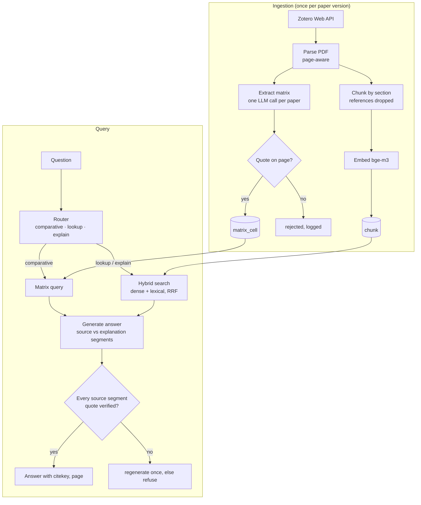

# Research assistant over dissertation papers

| | |
|---|---|
| **Status** | Draft, in review |
| **Issue** | #1 |
| **Author** | Hugo Hernández Moreno |
| **Scope** | MVP: 37 papers in three Zotero sub-collections |

## 1. Problem

The dissertation (shared autonomy and reactive stability control on a 1:10 buggy) draws on more papers than I can hold in my head. The questions I actually ask fall into three kinds, and plain top-k RAG serves only one of them well:

| Kind | Example | Why plain RAG struggles |
|---|---|---|
| **Comparative** | "Which papers control lateral stability with yaw rate, and with which vehicle model?" | Needs *every* relevant paper. Top-k returns the k most similar chunks; if twelve papers qualify, it silently drops seven. |
| **Lookup** | "What sampling frequency does paper X use in its controller?" | Works, if retrieval can be filtered to one paper. |
| **Explanatory** | "Based on paper X, explain Y." | Repeating the paper's text does not help when the text is what I did not understand. The answer must explain in other words *and* show what it rests on. |

## 2. Goals and non-goals

**Goals**
- Answer the three kinds of question over the 37 papers in scope.
- Never present an unsupported claim as coming from a paper: every claim about a paper carries a page and a verbatim quote that has been checked.
- Measure retrieval and extraction quality on questions I write myself, and report the numbers.

**Non-goals (MVP)**
- The other eight sub-collections (~170 papers).
- Citation graph, concept graph (GraphRAG / HippoRAG).
- Conversation memory across questions; a UI.
- Fine-tuning or training any model.

## 3. Corpus

Zotero sub-collections under *IS40 — Stability Control*:

| Sub-collection | Papers |
|---|---|
| stability control | 15 |
| state estimation | 10 |
| friction estimation | 12 |

PDFs are available through Zotero file sync, so the server ingests from the Zotero Web API and does not depend on the laptop. Papers are published work: their sensitivity is `PUBLIC`, so sending passages to the remote generation model is acceptable.

## 4. Overview

Four capabilities, one shared store. The *structure* of a question decides which one answers it.



## 5. Decisions

Each decision lists what was chosen, what was rejected, and why. These are the parts of the design to challenge.

### D1. A literature matrix, not only RAG

**Chosen:** at ingestion, an LLM reads each paper once and fills a schema; each non-empty cell carries a page and a verbatim quote. Comparative questions become queries over that table.

**Rejected:** answering comparative questions with top-k retrieval and a larger k.

**Why:** a larger k trades one failure for another: more noise per question and still no guarantee of completeness. Extraction moves the cost to ingestion, where it is paid once per paper (~0.5M tokens for all 37), and makes comparative answers exact and cheap at query time. It also matches how a literature review is done by hand.

### D2. Store matrix cells as rows (attribute, value), not as a wide table

**Chosen:** `matrix_cell(paper_id, attribute, value, page, quote, …)`.

**Rejected:** one table, or one column per attribute.

**Why:** the schema differs per sub-collection (§6). Rows let a new attribute be added without a migration, and let one paper have several values for the same attribute (a paper that tests two controllers). The cost is that "papers with filter = EKF *and* model = bicycle" needs a self-join; at 37 papers that is irrelevant.

### D3. A deterministic quote check, with normalisation

**Chosen:** a cell is stored only if its quote is found on the cited page after normalising both sides (Unicode NFKC, ligatures such as `fi`, hyphenation across line breaks, whitespace).

**Rejected:** trusting the model's quote; asking a second model whether the quote is genuine.

**Why:** the same principle as the brief's regex guard: an invented citation is the defect that matters most, and it can be caught exactly and for free. Without normalisation, real quotes would fail on PDF artefacts, so the check would reject true cells and get switched off.

### D4. PyMuPDF for parsing; GROBID only if measured to be needed

**Chosen:** PyMuPDF, extracting text per page in reading order, with section headings detected by font size and numbering.

**Rejected for now:** GROBID (a Java service producing structured TEI with clean sections and references).

**Why:** GROBID is better at structure but adds a service to run and maintain. With 37 papers I can inspect the section detection by hand. If headings are wrong in more than a few papers, GROBID is the next step, and the change is isolated behind the parser interface.

### D5. Lexical retrieval with Postgres full-text search

**Chosen:** a generated `tsvector` column with a GIN index, ranked with `ts_rank_cd`, fused with dense results by Reciprocal Rank Fusion (k = 60).

**Rejected:** an in-memory BM25 library; a separate search engine.

**Why:** everything stays in the one Postgres instance that already exists, so there is no second store to keep in sync. `ts_rank_cd` is not BM25. RRF fuses *ranks*, not scores, which makes the exact lexical scoring less important, and both retrievers sit behind the same `Retriever` protocol, so the evaluation can compare them and BM25 can be swapped in if lexical recall is the weak link.

### D6. A router, not an agent loop (for now)

**Chosen:** one cheap classification call routes the question to the matrix, to hybrid search, or to both, as a fixed pipeline.

**Rejected:** a free-running tool-calling agent.

**Why:** the same reasoning as the morning brief: when the steps are known, a pipeline is cheaper, testable and debuggable. An agent earns its place when questions need several dependent steps ("find the papers that use EKF, then compare their noise models"). The tools are built so that an agent can use them later without changes.

### D7. Answers separate source from explanation

**Chosen:** an answer is a list of segments, each either `SOURCE` (must carry citekey, page and a verified quote) or `EXPLANATION` (analogy, intuition, background; no citation, marked as such).

**Why:** this is what makes the explanatory mode useful without making it unfaithful: the explanation can use other words and outside knowledge, and the reader always sees which sentences rest on the paper.

### D8. Re-extraction is keyed on content and prompt

Every extracted cell records the PDF's SHA-256, the extractor model and the prompt version. Ingestion skips a paper whose hash and prompt version are unchanged, and re-extracts it when either changes. A bad cell can always be traced to the prompt that produced it, as with the brief.

## 6. The literature matrix schema

### Common attributes (every paper)

| Attribute | Meaning |
|---|---|
| `problem` | The problem the paper addresses, in one sentence |
| `method` | The main technique proposed or used |
| `platform` | Simulation, full-scale vehicle, or scaled platform (and which) |
| `evaluation` | How results are validated: simulation, track, dataset |
| `key_result` | The headline quantitative result |
| `limitations` | What the authors say does not work or is not covered |

### Per sub-collection

> [!IMPORTANT]
> **To be written by Hugo.** These are the columns worth comparing across papers in each sub-collection. They decide which comparative questions the system can answer exactly.

| Sub-collection | Attributes |
|---|---|
| stability control | *e.g. controlled variable (yaw rate, sideslip), vehicle model, controller type, actuation, …* |
| state estimation | *e.g. estimator (KF, EKF, UKF, observer), estimated states, sensors, sampling rate, …* |
| friction estimation | *e.g. method, excitation required, surfaces tested, …* |

## 7. Data model

New tables, separate from the personal `event` store: different data, different lifecycle, different reasons to change.

```sql
paper (
    id            uuid PRIMARY KEY,
    zotero_key    text UNIQUE NOT NULL,
    citekey       text UNIQUE NOT NULL,     -- Better BibTeX
    title, authors, year, venue, doi,
    collection    text NOT NULL,
    pdf_sha256    text NOT NULL
)

chunk (
    id            uuid PRIMARY KEY,
    paper_id      uuid REFERENCES paper,
    page          int  NOT NULL,
    section       text,
    content       text NOT NULL,
    embedding     vector(1024) NOT NULL,    -- HNSW, cosine
    tsv           tsvector GENERATED ALWAYS AS (to_tsvector('english', content)) STORED  -- GIN
)

matrix_cell (
    paper_id        uuid REFERENCES paper,
    attribute       text NOT NULL,
    value           text NOT NULL,
    page            int  NOT NULL,
    quote           text NOT NULL,
    extractor_model text NOT NULL,
    prompt_version  text NOT NULL
)
```

## 8. Evaluation

> [!IMPORTANT]
> **Questions to be written:** at least 30 (about 10 per sub-collection), each with the paper(s) and page(s) that answer it, stored in `eval/questions.yaml`. Only I can label them, and they are the most valuable artefact in the project.

| What | Metric | How |
|---|---|---|
| Retrieval | recall@5, MRR | lookup and explanatory questions vs labelled pages; reported for lexical, dense and hybrid |
| Matrix completeness | recall per attribute | comparative questions vs the set of papers I know qualify |
| Matrix correctness | precision | manual audit of a random sample of cells |
| Citations | verified-quote rate | share of `SOURCE` segments whose quote passes the check |
| Cost and speed | tokens and p50 latency per query | from the `Completion` usage already returned by the LLM layer |

No target numbers are set before a baseline exists. The first run sets the baseline; changes are judged against it.

## 9. Delivery

One PR per row, each referencing #1:

1. This design doc.
2. `feat(papers)`: Zotero ingestion, PDF parsing, chunking, tables and migration.
3. `feat(papers)`: matrix extraction with quote verification.
4. `feat(retrieval)`: lexical + dense retrievers and RRF behind one protocol.
5. `feat(eval)`: question set, metrics, first baseline in the README.
6. `feat(api)`: `/ask` with router, segments and citation check. Closes #1.

## 10. Open questions

- Does the Zotero Web API expose the Better BibTeX citation key directly, or must it be read from the item's *Extra* field? To verify on the first ingestion.
- Do any papers rely on equations or tables for the facts the matrix needs? If so, PyMuPDF's plain text may lose them (see D4).
- Is one extraction call per paper reliable at ~15k tokens of input, or should extraction run per section?
